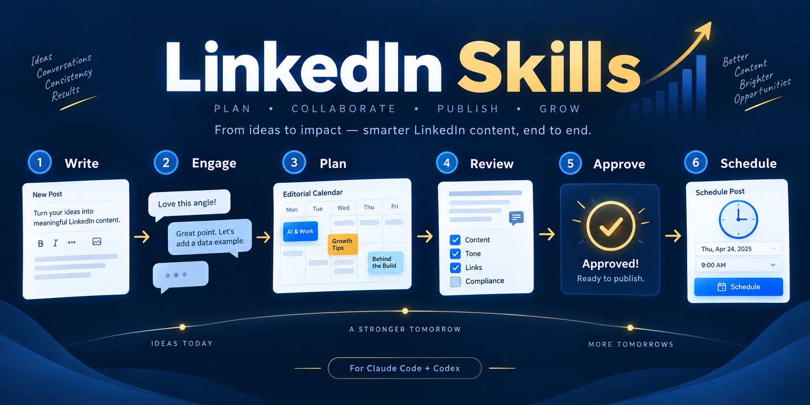

# LinkedIn Skills for Claude Code and Codex

[](https://github.com/samalyxx/linkedin-skills/releases)
[](.claude-plugin/plugin.json)
[](.codex-plugin/plugin.json)
[](SKILL.md)
[](LICENSE)
[](https://github.com/samalyxx/linkedin-skills/stargazers)
[](CONTRIBUTING.md)

**LinkedIn Skills** is a practical, draft-first LinkedIn marketing bundle for Claude Code and Codex. It helps you turn real source material into credible posts, comments, replies, plans, profile improvements, and reviewable experiments—without inventing results or claiming LinkedIn access.



## What you can do

Once installed, ask in plain language. The relevant skill handles the workflow.

- **Write a post:** “Turn these verified product notes into a LinkedIn post for a B2B founder.”
- **Comment thoughtfully:** “Draft a useful comment on this supplied post; add one supported point.”
- **Improve a draft:** “Humanize this copy without changing its claims.”
- **Plan content:** “Create a 7-day LinkedIn plan for a cybersecurity consultant.”
- **Review a profile:** “Audit this LinkedIn profile for positioning and credibility.”
- **Learn from results:** “Analyze this engagement export; separate findings from guesses.”

## Install

Choose the route that matches your agent. The repository is public and the skills work without an API key.

### Codex CLI

```bash
codex plugin marketplace add samalyxx/linkedin-skills
codex plugin add linkedin-skills@linkedin-skills
```

For a local checkout:

```bash
git clone https://github.com/samalyxx/linkedin-skills.git
cd linkedin-skills
codex plugin marketplace add .
codex plugin add linkedin-skills@linkedin-skills
```

### Claude Code

If your Claude Code version exposes plugin commands, add the marketplace and install the bundle:

```text
/plugin marketplace add samalyxx/linkedin-skills
/plugin install linkedin-skills@linkedin-skills
```

If plugin commands are unavailable, clone the repository into your working directory. Claude Code can read the canonical [`skills/`](skills/) instructions directly.

### Claude web or desktop

1. Open **Customize** and then **Plugins**.
2. Add a marketplace from the repository `samalyxx/linkedin-skills`.
3. Find **LinkedIn Skills** in the marketplace and install it.
4. Start a new chat and request a LinkedIn task in normal language.

### Any SKILL.md-compatible agent

```bash
npx skills add samalyxx/linkedin-skills
```

Or clone the repository where your agent discovers `SKILL.md` files.

## The 12 skills

| Skill | Outcome |
| --- | --- |
| Post writer | Evidence-led post draft with a clear audience, angle, and claim boundary. |
| Comment drafter | A substantive comment grounded in the supplied post. |
| Reply handler | Safe, owner-aware reply drafts for comments on your post. |
| Humanizer | Voice edit that retains facts and does not fabricate experience. |
| Hook extractor | Opening-angle options that connect honestly to the body. |
| Content planner | Editorial themes, briefs, owners, and measurable experiments. |
| Profile optimizer | Positioning review and ready-to-edit profile suggestions. |
| Repurposer | Source-faithful LinkedIn adaptation or post series. |
| Employee advocacy | Voluntary advocacy briefs with truthful personalization. |
| Thread monitor | Bounded thread triage, priorities, and escalation routes. |
| Engager analytics | Observations, hypotheses, and next tests from supplied data. |
| Interviewer | Structured story capture from real professional experiences. |

## Draft first. Publish only with approval.

By default, every skill creates reviewable drafts for you to copy into LinkedIn. The bundle does not scrape LinkedIn, save account data, or include credentials.

If you explicitly connect SocialBu MCP at `https://socialbu.com/mcp`, the agent may prepare a LinkedIn publish or schedule action. It must first show the complete final post, the selected LinkedIn account, links/media, and exact time. It may execute only after a new confirmation for that unchanged preview. See [the publishing boundary](references/socialbu-publishing.md).

## Verify a checkout

```bash
./scripts/validate.sh
python3 -m unittest discover -s tests
python3 scripts/selftest.py
```

## Contribute

Read [CONTRIBUTING.md](CONTRIBUTING.md), [CLAUDE.md](CLAUDE.md), and [SECURITY.md](SECURITY.md). This independent project is not affiliated with LinkedIn, Claude, Codex, or SocialBu.
